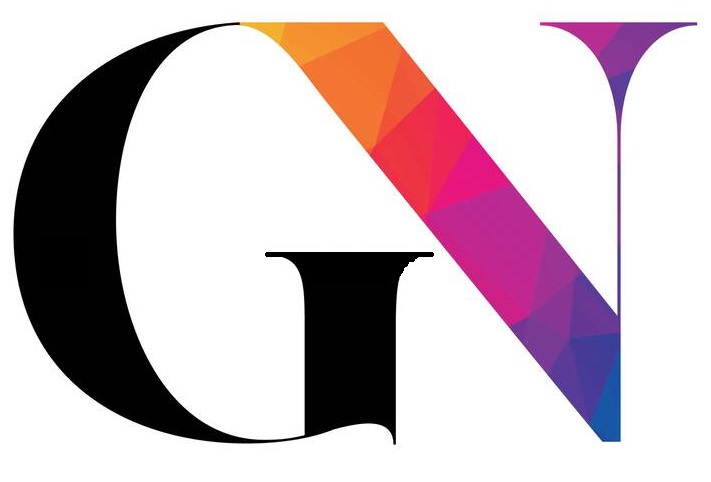

# Quiz sulla Moda Sostenibile 👗🌱

Un'applicazione web interattiva realizzata in **React + TypeScript**, che propone un quiz a difficoltà progressiva per sensibilizzare l'utente sul tema della **moda sostenibile**.

## 🎯 Obiettivo del progetto

Informare in modo coinvolgente e accessibile su pratiche sostenibili nel settore moda, attraverso un quiz con 5 domande a scelta multipla e feedback finale personalizzato.

---

## ⚙️ Scelte tecniche

### React + Vite

- Utilizzato per performance elevate e rapidità di sviluppo.

### TypeScript

- Utilizzato in tutto il progetto per una tipizzazione rigorosa.
- Ogni componente ha props e logica tipizzata per evitare errori a runtime.

### Componenti principali

- `Home.tsx`: schermata di benvenuto.
- `QuizIntro.tsx`: istruzioni sul funzionamento del quiz.
- `Quiz.tsx`: logica del quiz, punteggio e stato.
- `Result.tsx`: risultato finale con livello assegnato.
- `PageLayout.tsx`: struttura condivisa e coerente.

### React Router

- Navigazione tra le pagine (`/`, `/quizIntro`, `/quiz`, `/result`) usando `react-router-dom`.

### SCSS

- Separazione tra stile globale e responsive con variabili e media query.
- Il file `responsive.scss` assicura una UX fluida su tutti i dispositivi.

### Responsive design

- Progetto ottimizzato per desktop, tablet e mobile.
- Il box centrale si adatta in base alla dimensione dello schermo, mantenendo leggibilità e visibilità dello sfondo.

### Favicon personalizzata

- Una t-shirt verde con foglia per rappresentare il tema moda sostenibile.

### Logica quiz

- Domande progressivamente più complesse:
  - 1–2: livello base
  - 3–4: livello intermedio
  - 5: livello esperto
- Punteggio tracciato via stato React (`useState`) e inviato alla pagina risultato tramite `useNavigate`.

---

## ▶️ Come avviare il progetto in locale

1. Clona il repository

```bash
git clone https://github.com/Britney-gio/quiz-sostenibile.git
cd quiz-sostenibile
```

2. Installa le dipendenze

```bash
npm install
```

3. Avvia il server di sviluppo

```bash
npm run dev
```

4. Apri il browser su http://localhost:5173 per visualizzare l'app

## 👩‍💻 Autore

<p align="left">
  
</p>

Sviluppato da **Giorgia Nieli**  
Per **AgenziaX** – Comunicazione creativa per una moda più responsabile ✨

- 📧 Email: [giorgianieli@gmail.com](mailto:giorgianieli@gmail.com)
- 💼 GitHub: [@Britney-gio](https://britney-gio.github.io/)
- 🔗 LinkedIn: [linkedin.com/in/giorgia-nieli-98b0882b0](https://www.linkedin.com/in/giorgia-nieli-98b0882b0/)
